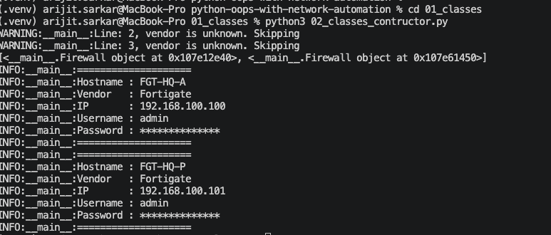
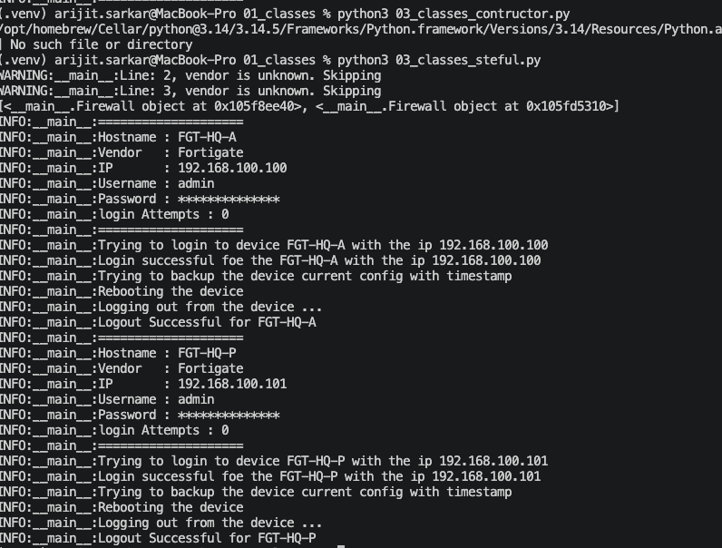

# Classes

## Topics Covered

- class
- object
- self
- __init__
- instance variables
- methods

## Basics of class
- How to define or create a class 01_classes_basic.py
- Output is below

### What I learned?
- Initially I just defined the class and under that one function
- Later I didn't created an instance of the class and was not fruitful.
- Later class without a constructor is funny it just work like a function.
    - Becuase everytime I need to pass all the variables like - hostname, ip, vendor and all the details.

## 02 Class Contructors
- We do use contructiors for holding a data for permanent basis with a custom data structure.
- We do not need to pass the data multiple time.

## 03 Class Setful
- How to use the class to extend the functionality, and two different types of variable declaration learned over here.

# Next Plans to cover following 
- Constructor

## Networking Example

Implemented a Firewall class that can

- Login
- Logout
- Backup configuration
- Show information

## Skills Will be Learned

- Creating objects
- Using self
- Calling methods
