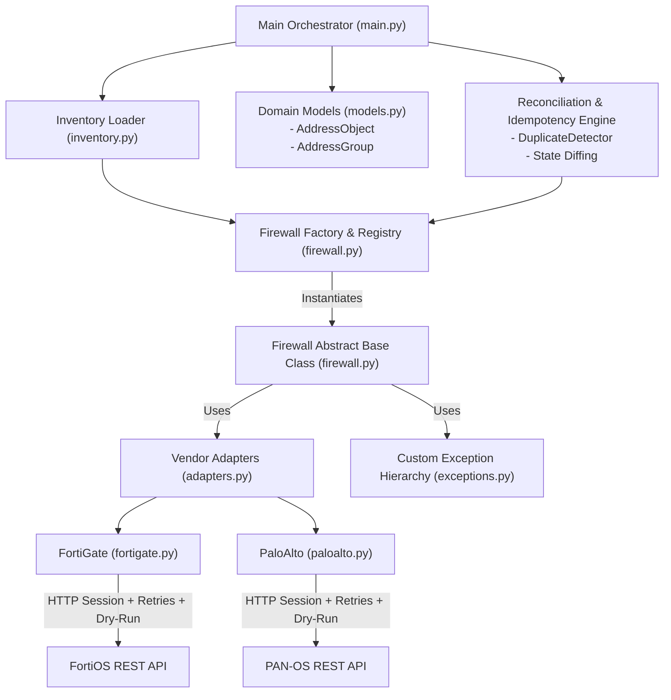

# 🚀 FAANG-Grade Multi-Vendor Firewall Automation Framework Roadmap

This document serves as your technical blueprint and progressive task tracker for transforming the `07_multi_vendor_framework` codebase into a production-grade, FAANG-level (Google, Meta, AWS, Cloudflare, Apple) network automation framework.

---

## 🏛️ Target System Architecture



---

## 📊 Gap Analysis: Current Baseline vs. FAANG Engineering Standard

| Feature Domain | Current Code Baseline | FAANG Production Standard |
| :--- | :--- | :--- |
| **Data Contracts** | Raw Python dicts / vendor-specific JSON strings | Standardized `@dataclass` / Pydantic domain models (`AddressObject`, `AddressGroup`) |
| **Vendor Payloads** | Hardcoded JSON payload structures per vendor file | **Adapter Pattern** converting standard domain models to/from vendor schemas |
| **Idempotency** | Always sends POST request (fails on duplicate or causes HTTP 400/409) | Pre-flight state check (`exists()`), local/remote duplicate detection (`DuplicateDetector`), and diffing |
| **Error Handling** | Generic `requests.exceptions.HTTPError` logging | Domain exception tree (`NetworkAutomationError` base, `DuplicateResourceError`, `AuthenticationError`, etc.) |
| **Safety & Audit** | Direct POST calls to live IPs | `--dry-run` safety mode, change diff previews, and structured audit logs |
| **Device Inventory** | Hardcoded constructor calls in `main.py` | CSV/YAML `InventoryLoader` coupled with `@register_firewall` dynamic factory |
| **Session Lifecycle** | Basic `create_session()` method | Python Context Manager (`with Firewall(...) as fw:`) & connection recycling |
| **Scalability** | Single-threaded `for` loop | `ThreadPoolExecutor` concurrent runner across hundreds of devices |
| **Testing Quality** | Manual runs hitting real IP addresses | Offline unit test suite with `pytest` and HTTP API mocks (`unittest.mock` / `responses`) |

---

## 📋 Progression Roadmap & Task Breakdown

### 🟦 Level 1: Domain Data Models & Exception Hierarchy (Foundational)
*Goal: Remove vendor-specific dicts from user code and establish strict error domains.*

- [ ] **Task 1.1: Create Standardized Domain Models ([`models.py`](file:///Users/arijit.sarkar/github/python-oops-with-network-automation/07_multi_vendor_framework/models.py))**
  - Implement `@dataclass` `AddressObject` (`name`, `ip_netmask`, `description`, `type`, `tags`).
  - Implement `@dataclass` `AddressGroup` (`name`, `members`, `description`).
  - Add validation methods (e.g., valid IP/CIDR syntax check using Python's `ipaddress` module).

- [ ] **Task 1.2: Build Domain Exception Hierarchy ([`exceptions.py`](file:///Users/arijit.sarkar/github/python-oops-with-network-automation/07_multi_vendor_framework/exceptions.py))**
  - Base class: `NetworkAutomationError(Exception)`
  - Subclasses: `DeviceConnectionError`, `AuthenticationError`, `APIResponseError`, `DuplicateResourceError`, `ValidationError`.

---

### 🟩 Level 2: Adapter Pattern & Dynamic Factory Clean-Up (Modularity)
*Goal: Isolate vendor JSON schema logic and standardize object instantiation.*

- [ ] **Task 2.1: Build Vendor Payload Adapters ([`adapters.py`](file:///Users/arijit.sarkar/github/python-oops-with-network-automation/07_multi_vendor_framework/adapters.py))**
  - Abstract base adapter `BaseAdapter` with `to_vendor_address()`, `from_vendor_address()`, `to_vendor_group()`, `from_vendor_group()`.
  - Concrete `FortiGateAdapter`: Maps domain model to `/api/v2/cmdb/firewall/address` structure.
  - Concrete `PaloAltoAdapter`: Maps domain model to `/restapi/v10.0/Objects/Addresses` structure.

- [ ] **Task 2.2: Refactor Vendor Classes & Decorators**
  - Ensure `PaloAlto` uses `@register_firewall("PaloAlto")` (currently missing).
  - Update `Fortigate` and `PaloAlto` methods to accept `AddressObject` and `AddressGroup` domain models instead of raw dicts.

---

### 🟨 Level 3: Idempotency & Duplicate Detection Engine (Reliability)
*Goal: Prevent duplicate resource creation and enforce state reconciliation.*

- [ ] **Task 3.1: Build Local Duplicate Detector ([`duplicate_detector.py`](file:///Users/arijit.sarkar/github/python-oops-with-network-automation/07_multi_vendor_framework/duplicate_detector.py))**
  - Implement `DuplicateDetector` class to check for:
    - Duplicate names across input address objects.
    - Duplicate IP subnets/addresses assigned to different names.
    - Overlapping or redundant group memberships.

- [ ] **Task 3.2: Implement Pre-Flight Check & Idempotent Syncing**
  - Add `exists(object_name)` abstract/concrete method to `Firewall` base class.
  - Implement `sync_address(address_obj)` in vendor classes:
    - Query device -> If object exists and attributes match: Return `SKIPPED (NO_CHANGE)`.
    - If object exists but attributes differ: Update object (`UPDATE`).
    - If object does not exist: Create object (`CREATED`).

---

### 🟧 Level 4: Production Engine & Safety Features (Enterprise Readiness)
*Goal: Support dry-run execution, safe session handling, and dynamic inventory parsing.*

- [ ] **Task 4.1: Add Dry-Run Mode & Audit Logging**
  - Add `dry_run: bool = False` parameter to `Firewall` class.
  - When `dry_run=True`, log the HTTP method, target URL, and JSON payload without sending actual API requests. Return a simulated success response (`{"status": "DRY_RUN_SUCCESS"}`).

- [ ] **Task 4.2: Implement Context Manager Protocol**
  - Add `__enter__` and `__exit__` methods to `Firewall` class for automated session opening (`create_session()`) and closing (`close_session()`).

- [ ] **Task 4.3: Implement Dynamic Inventory Loader ([`inventory.py`](file:///Users/arijit.sarkar/github/python-oops-with-network-automation/07_multi_vendor_framework/inventory.py))**
  - Build `InventoryLoader` to read `inventory.csv`.
  - Use `FIREWALL_LIST` factory registry to instantiate appropriate vendor classes automatically.

---

### 🟥 Level 5: FAANG Scale & Quality (Concurrency & Testing)
*Goal: Execute at scale and maintain 100% test coverage with offline mocks.*

- [ ] **Task 5.1: Build Concurrent Execution Engine ([`runner.py`](file:///Users/arijit.sarkar/github/python-oops-with-network-automation/07_multi_vendor_framework/runner.py))**
  - Implement `ConcurrentRunner` using `concurrent.futures.ThreadPoolExecutor`.
  - Execute sync operations across multiple firewalls simultaneously with thread-safe logging and error aggregation.

- [ ] **Task 5.2: Build Comprehensive Unit Tests with HTTP Mocks ([`tests/`](file:///Users/arijit.sarkar/github/python-oops-with-network-automation/07_multi_vendor_framework/tests))**
  - Set up `tests/test_fortigate.py`, `tests/test_paloalto.py`, `tests/test_adapters.py`, `tests/test_duplicate_detector.py`.
  - Use `unittest.mock` / `responses` to mock HTTP API calls with fixture JSONs.

---

## 🛠️ Complete Target Folder Structure

```
07_multi_vendor_framework/
├── README.md                       # Overview & basic instructions
├── FRAMEWORK_EVOLUTION_ROADMAP.md  # (This document) FAANG roadmap & task tracker
├── main.py                         # Entry point orchestrator
├── inventory.csv                   # Device inventory data
├── logging_basic_config.py         # Logging configuration
├── firewall.py                     # Abstract Base Class & Factory Registry
├── fortigate.py                    # FortiGate implementation
├── paloalto.py                     # Palo Alto implementation
├── models.py                       # Domain Data Models (AddressObject, AddressGroup)
├── exceptions.py                   # Custom Exception Hierarchy
├── adapters.py                     # Vendor API Adapters
├── duplicate_detector.py           # Pre-flight Idempotency & Duplicate Checker
├── inventory.py                    # Inventory CSV Parser & Factory Builder
├── runner.py                       # Concurrency / Parallel Execution Engine
└── tests/                          # Unit tests directory
    ├── test_adapters.py
    ├── test_duplicate_detector.py
    ├── test_fortigate.py
    └── test_paloalto.py
```
